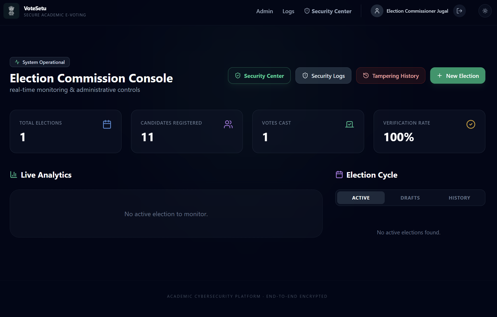

<div align="center">
  
  # 🔐 VoteSetu: Advanced Web Interface for the Democratic Process
  
  **A Next-Generation, Secure, and Real-Time Election Management System**

  [](https://reactjs.org/)
  [](https://nodejs.org/)
  [](https://www.mongodb.com/)
  [](https://socket.io/)
  []()
</div>

<br />

## 🌟 Overview

**VoteSetu** is an advanced, highly secure digital voting platform engineered to ensure the integrity, transparency, and efficiency of modern elections. Incorporating a state-of-the-art **Real-Time Security Command Center**, VoteSetu mitigates threats instantaneously while providing voters with an intuitive, seamless, and dynamic user experience.

### ✨ Key Features

- 🛡️ **Uncompromised Security**: End-to-end encryption, real-time threat monitoring, and robust authentication mechanisms (2FA/MFA).
- 📡 **Real-Time Command Center**: Integrated satellite-map visualization for threat intelligence, live tracking of security events using **Socket.io**, and browser-based GPS telemetry.
- 🎨 **Premium UI/UX**: Designed with a futuristic dark-mode aesthetic, sleek glassmorphism elements, neon accents, and frictionless micro-animations for an elevated user experience.
- 📊 **Dynamic Dashboards**: Comprehensive analytics and administrative control boards providing instant insights into voter turnout, security logs, and live system health.

---

## 📸 Sneak Peek

### Security Command Center



---

## 🏗️ Architecture Stack

### Frontend
- **Framework:** React / Vite
- **Styling:** Vanilla CSS (Dark Mode & Glassmorphism Design System)
- **Features:** High-fidelity UI mapping, Real-Time sockets integration

### Backend
- **Core:** Node.js, Express.js
- **Real-Time Engine:** Socket.io
- **Database:** MongoDB
- **Security:** JWT Authentication, Rate Limiting, Input Sanitization

---

## 🚀 Getting Started

To run VoteSetu locally, ensure you have Node.js and MongoDB installed on your system.

### Prerequisites

- Node.js (v18+)
- MongoDB (Running locally or via Atlas)

### Installation

1. **Clone the repository:**
   ```bash
   git clone https://github.com/jugal-ahir/VoteSetu.git
   cd VoteSetu
   ```

2. **Install Backend Dependencies & Start:**
   ```bash
   cd backend
   npm install
   npm run dev
   ```

3. **Install Frontend Dependencies & Start:**
   ```bash
   cd ../frontend
   npm install
   npm run dev
   ```

4. **Access the application:**
   - Frontend: `http://localhost:5173`
   - Backend: `http://localhost:5000`

---

## 🔒 Security Posture

VoteSetu has been heavily optimized for cyber resilience. The real-time security dashboard is decoupled from the voter-facing interfaces to prevent any unintended exposure of sensitive threat telemetry. All communications are heavily monitored for anomalous behaviour and mitigated via continuous event logging. 

---

<div align="center">
  <b>Built with ❤️ and advanced cryptography by Jugal Ahir.</b>
</div>
